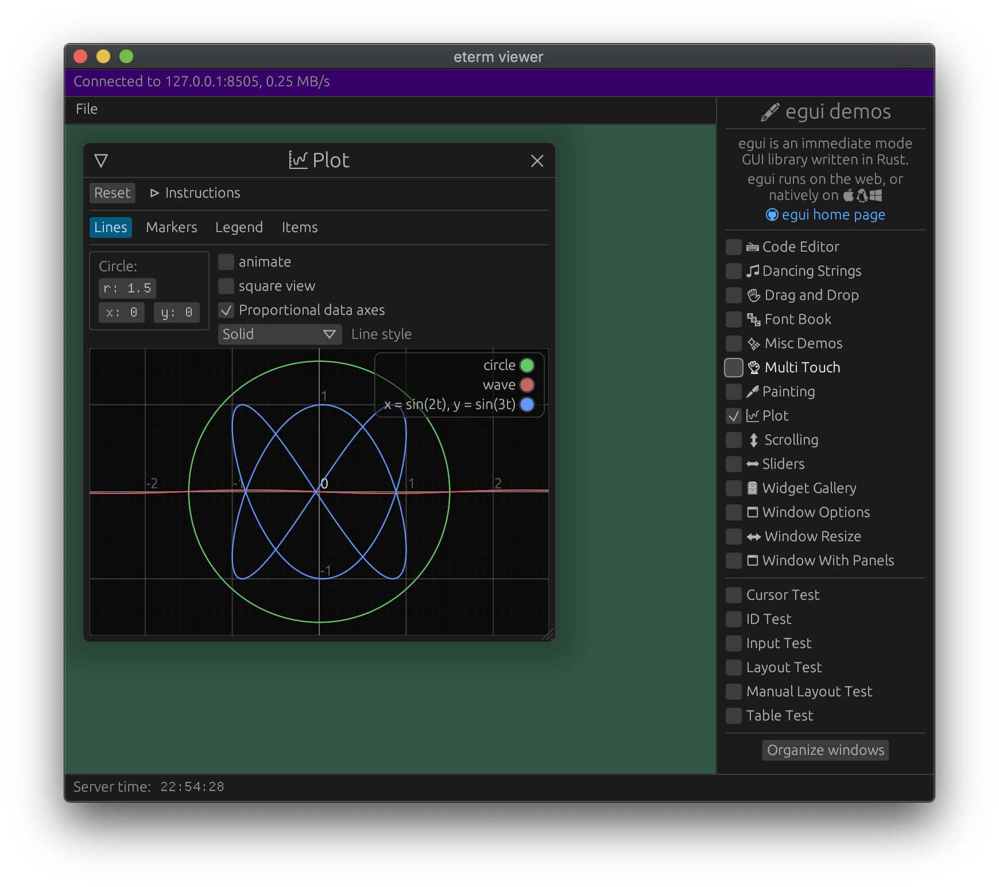

# eterm: a visual terminal for [egui](https://github.com/emilk/egui/)

[](https://crates.io/crates/eterm)
[](https://docs.rs/eterm)
[](https://github.com/rust-secure-code/safety-dance/)
[](https://github.com/emilk/eterm/actions?workflow=CI)


If you have a service written in rust (running on the cloud, or even locally) that you need to inspect, `eterm` might be for you.

By adding a few lines of rust to your service you can connect to it over TCP and get a visual terminal, allowing you to inspect apsects of the running process and/or configure it.

**NOTE**: This is work-in-progress!

## How do I use `eterm`?
On the service you want to inspect you add the following:


``` rust
let mut eterm_server = eterm::Server::new("0.0.0.0:8505")?;

…

eterm_server
    .show(|egui_ctx: &egui::Context, client_id: eterm::ClientId| {
        egui::CentralPanel::default().show(egui_ctx, |ui| {
            ui.label("Some important stats");
            ui.checkbox(&mut some_option, "Option enabled");
        });
    });
```

This will listen for TCP connections on port `8505`. You connect to it using `eterm_viewer --url 127.0.0.1:8505`.

## How does it work?
The `eterm_viewer` captures mouse and keyboard input and send it to the server. The servers runs the gui code and collects what to draw and sends it back to the viewer, which displays it.

What is sent is not a picture of the rendered gui, but basic shapes such as rectangles, lines and text. This keeps the bandwidth use reasonably low, even though eterm sends the entire screen each frame (no delta-encoding!).

To save bandwidth, frames are only sent when there is change on screen.

## Testing
``` sh
cargo run --release --example game_server  &
cargo run --release -p eterm_viewer -- --url 127.0.0.1:8505
```

## Limitations and future work
There is no authentication and no encryption.

The implementation is pretty basic so far, and is probably wasting a bit of CPU.

eterm uses no delta-encoding, so with visually intense scenes it can use a lot of bandwidth (> 1MB/s).

It would be nice to port the viewer to `eframe` so we can compile it for the web. Requires a Rust TCP library that works with web-sockets.

## Screenshot


